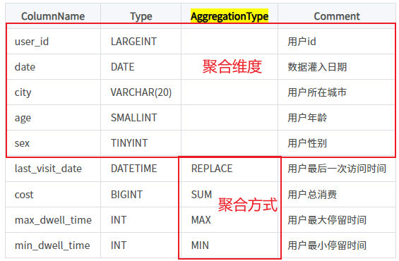

# 模型说明
>因为数据模型在建表时就已经确定，且无法修改。所以，选择一个合适的数据模型非常重要。
## Aggregate聚合模型(读时合并)
1. 聚合模型简单来说是将参数划分为两类，key（维度）,value（指标）
 
 目前支持的聚合方式
 - SUM：求和，多行的 Value 进行累加。
- REPLACE：替代，下一批数据中的 Value 会替换之前导入过的行中的 Value。
- MAX：保留最大值。
- MIN：保留最小值
```sql
CREATE TABLE IF NOT EXISTS example_db.example_tbl
(
    `user_id` LARGEINT NOT NULL COMMENT "用户id",
    `date` DATEV2 NOT NULL COMMENT "数据灌入日期时间",
    `city` VARCHAR(20) COMMENT "用户所在城市",
    `age` SMALLINT COMMENT "用户年龄",
    `sex` TINYINT COMMENT "用户性别",
    `last_visit_date` DATETIME REPLACE DEFAULT "1970-01-01 00:00:00" COMMENT "用户最后一次访问时间",
    `cost` BIGINT SUM DEFAULT "0" COMMENT "用户总消费",
    `max_dwell_time` INT MAX DEFAULT "0" COMMENT "用户最大停留时间",
    `min_dwell_time` INT MIN DEFAULT "99999" COMMENT "用户最小停留时间"
)
# 维度：即聚合的依据
AGGREGATE KEY(`user_id`, `date`, `city`, `age`, `sex`) 
DISTRIBUTED BY HASH(`user_id`) BUCKETS 1
PROPERTIES (
"replication_allocation" = "tag.location.default: 1"
);
```
>AGGREGATE KEY 数据模型中，所有没有指定聚合方式（SUM、REPLACE、MAX、MIN）的列视为 Key 列。而其余则为 Value 列。

定义列时，可参照如下建议：

- Key 列必须在所有 Value 列之前。
- 尽量选择整型类型。因为整型类型的计算和查找效率远高于字符串。
- 对于不同长度的整型类型的选择原则，遵循 够用即可。
- 对于 VARCHAR 和 STRING 类型的长度，遵循 够用即可。


## Unique模型（读时合并/写时合并）
> 设置主键，只有导入数据的主键一致时，才会聚合数据
> 读时合并：在建立实体时，设置固定的聚合方式（以上四种），只有查询时才会合并数据
> 写时合并：在建立实体时，设置的聚合方式为none，再写入时，会自动覆盖原有数据
> 应用环境：
>> 1. 第二次导入的数据无法确定是否在第一次中包含时，使用该种聚合模式，设置好聚合方式可不在乎两次数据的冲突性
## Duplicate模型
> 不对写入数据进行任何处理，不进行聚合等操作
> 用于指定对数据进行根据参数排序的模型
```sql
CREATE TABLE IF NOT EXISTS example_db.example_tbl
(
    `timestamp` DATETIME NOT NULL COMMENT "日志时间",
    `type` INT NOT NULL COMMENT "日志类型",
    `error_code` INT COMMENT "错误码",
    `error_msg` VARCHAR(1024) COMMENT "错误详细信息",
    `op_id` BIGINT COMMENT "负责人id",
    `op_time` DATETIME COMMENT "处理时间"
)
# 进行排序的依据
DUPLICATE KEY(`timestamp`, `type`, `error_code`)
DISTRIBUTED BY HASH(`type`) BUCKETS 1
PROPERTIES (
"replication_allocation" = "tag.location.default: 1"
);
```

## 数据分区
```sql
#分区类型和内容
PARTITION BY RANGE(`date`)
(
    PARTITION `p201701` VALUES LESS THAN ("2017-02-01"),
    PARTITION `p201702` VALUES LESS THAN ("2017-03-01"),
    PARTITION `p201703` VALUES LESS THAN ("2017-04-01")
)
#划分规则（分区内或整表）
DISTRIBUTED BY HASH(`user_id`) BUCKETS 16
PROPERTIES
(
    "replication_num" = "3",
    "storage_medium" = "SSD",
    "storage_cooldown_time" = "2018-01-01 12:00:00"
);
```

### 1. Partition（数据设置分区）
- Partition 列可以指定一列或多列，分区列必须为 KEY 列。多列分区的使用方式在后面 多列分区 小结介绍。
- 不论分区列是什么类型，在写分区值时，都需要加双引号。
- 分区数量理论上没有上限。
- 当不使用 Partition 建表时，系统会自动生成一个和表名同名的，全值范围的 Partition。该 Partition 对用户不可见，并且不可删改。
- 创建分区时不可添加范围重叠的分区。
目前的分区范围
```
  p201701: [MIN_VALUE,  2017-02-01)
   p201702: [2017-02-01, 2017-03-01)
   p201703: [2017-03-01, 2017-04-01)
```
> 分区的删除不会改变已存在分区的范围。删除分区可能出现空洞。
```
即删除[p201702]时,分区变为
p201701: [MIN_VALUE,  2017-02-01)
p201703: [2017-03-01, 2017-04-01)
形成空洞[2017-02-01,2017-03-01)
```
> 通过 VALUES LESS THAN 语句增加分区时，分区的下界紧接上一个分区的上界。