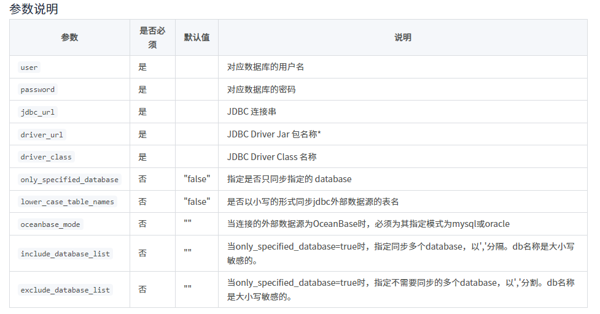

# 连接
## jdbc连接
### mysql连接
```mysql
CREATE CATALOG jdbc_mysql PROPERTIES (
    "type"="jdbc",
    "user"="root",
    "password"="123456",
    "jdbc_url" = "jdbc:mysql://10.1.3.142:3306/jcys",
    "driver_url" = "file:///path/to/mysql-connector-java-5.1.36.jar",
    "driver_class" = "com.mysql.jdbc.Driver"
)
```



>driver_url 可以通过以下三种方式指定：
>
>>1. 文件名。如 mysql-connector-java-5.1.47.jar。需将 Jar 包预先存放在 FE 和 BE 部署目录的 jdbc_drivers/ 目录下。系统会自动在这个目录下寻找。该目录的位置，也可以由 fe.conf 和 be.conf 中的 jdbc_drivers_dir 配置修改。
>>
>>1. 本地绝对路径。如 file:///path/to/mysql-connector-java-5.1.47.jar。需将 Jar 包预先存放在所有 FE/BE 节点指定的路径下。
>>
>>1. Http 地址。如：https://doris-community-test-1308700295.cos.ap-hongkong.myqcloud.com/jdbc_driver/mysql-connector-java-5.1.47.jar。系统会从这个 http 地址下载 Driver 文件。仅支持无认证的 http 服务。
***
>数据查询
```mysql
示例：select * from mysql_catalog.mysql_database.mysql_table where k1 > 1000 and k3 ='term';
select * from jdbc_mysql.jcys.jcy_szjc_jjxzcf_fc ;
```
## 直连数据库（已过时）
> 默认不支持该种使用方式，若要使用，则需要自编译doris
### mysql
```mysql
CREATE TABLE jcy_szjc_bqsxzcf_dp(
  `xh` varchar(255) DEFAULT NULL,
  `xm` varchar(255) DEFAULT NULL,
  `ab` varchar(255) DEFAULT NULL,
  `xb` varchar(255) DEFAULT NULL,
  `aqzy` varchar(255) DEFAULT NULL,
  `zcbqssj` varchar(255) DEFAULT NULL,
  `cfqk` varchar(255) DEFAULT NULL
)
ENGINE=mysql
PROPERTIES
(
 "host" = "10.1.3.142",
 "port" = "3306",
 "user" = "root",
 "password" = "123456",
 "database" = "jcys",
 "table" = "jcy_szjc_bqsxzcf_dp"
);
```
##  odbc连接（未成功）
### mysql
1. 安装odbc
1. 修改be节点的连接
```ssh
vim be/odbcinst.ini
```
添加以下内容
```
#该名称要与连接所用驱动名称相同
[MySQL ODBC 5.0 ANSI Driver]
#连接所用的驱动
Driver=/usr/lib64/libmyodbc5a.so
UsageCount=1
```

2. 执行类似以下的语句
``` mysql
    CREATE EXTERNAL RESOURCE `mysql_odbc_test`
            PROPERTIES (
            "type" = "odbc_catalog",
            "host" = "10.1.3.142",
            "port" = "3306",
            "user" = "root",
            "password" = "123456",
            "database" = "jcys",
            "odbc_type" = "mysql",
            "driver" = "MySQL ODBC 5.0 Unicode Driverr"#以上所添加的驱动名称
        );

    CREATE EXTERNAL  TABLE `jcy_xzxscf_jq` (
      `AJBH` text,
      `AJMC` text,
      `XYRXM` text,
      `AJLX` text,
      `CBDW` text,
      `SLSJ` text,
      `ZBDW` text,
      `AY` text,
      `AJZT` text
    ) ENGINE=ODBC 
    COMMENT '' 
    PROPERTIES (
    "odbc_catalog_resource" = "mysql_odbc_test",
    "database" = "jcys",
    "table" = "jcy_xzxscf_jq"
);
```
